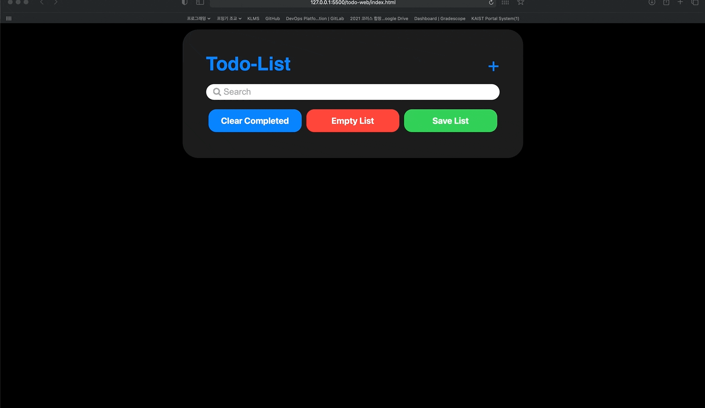
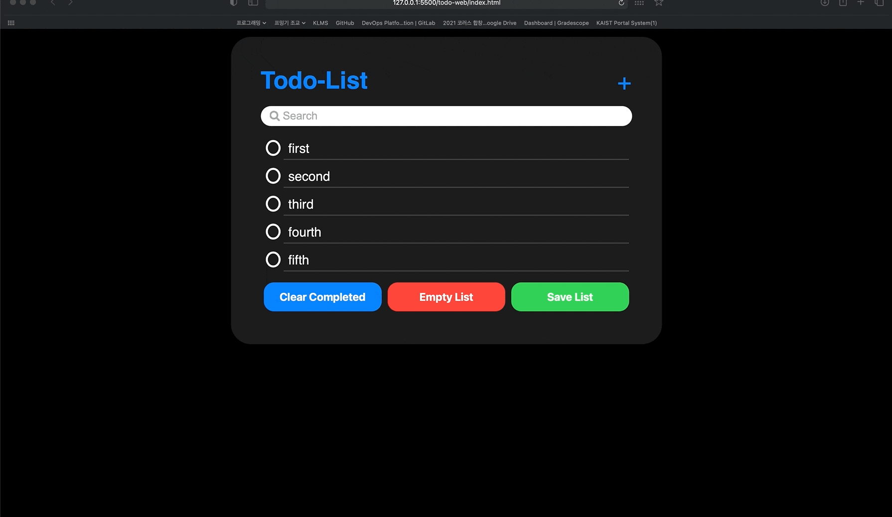
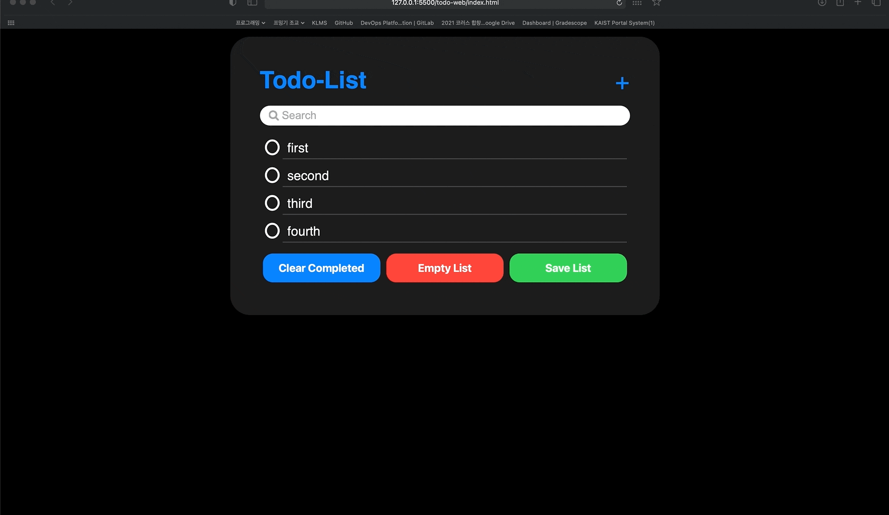
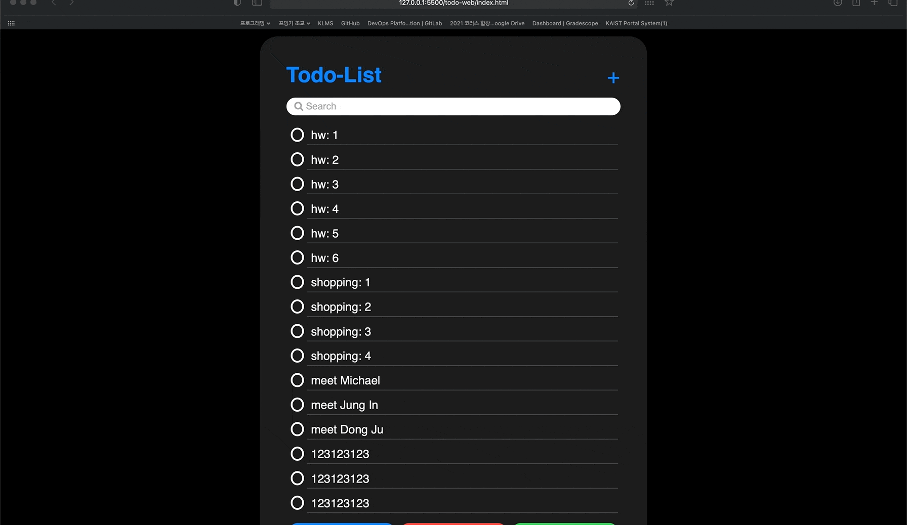
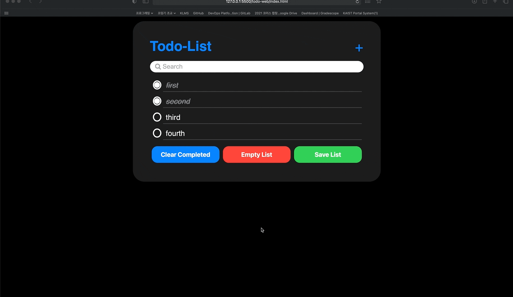

# ToDoList
---
This is my first website, **ios-like-Todo-List**, made using basic `HTML`, `CSS`, `Javascript`.
I refered ios reminder app for the design.

## Functionalities
---
### 1. Add new Todo
Add new todo by opening a modal window. Date and time box is not implemented.

### 2. Mark/Unmark Completed
Mark/unmark todos as completed by clicking buttons. 

### 3. Clear Completed
Clear completed todos.

### 4. Save List
Save todo list to the local storage. After it is saved, it will remain as it is after refreshing.

### 5. Search Todos
Filter todos those contain given string in search input box.

### 6. Empty List
Clear all todos in the list

